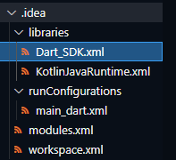

### Entry Point - Main Method

### Type-Safe
As we have seen before, although Dart is type-safe, type annotations are optional. Here, we declare a variable with no type and assign a String literal to
it.

### Widget Tree

### Conditional Programming in UI on different platforms

Using conditional programming, you can make the UI appear different on different platforms. E.g. one look in android, another/different in Mac OS , windows, or Web. We can also make it appear same of all platforms.

### One Codebase

### Everything is Widget

Widget k andar widget. Tree ki tarah. Widgets ka tree.

### Dart - Combination of three languages

Dart = Java + JS + C#

### Project Files Generated

.idea

android

build

ios

lib

test

packages

pubspec.yml

README
